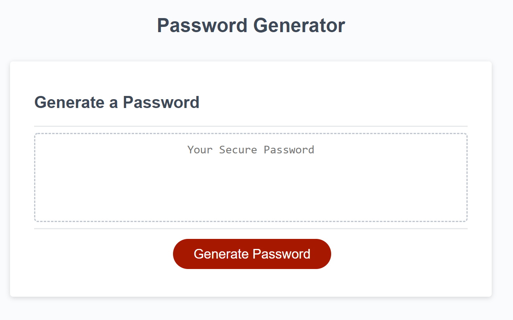

# Password Generator
TABLE OF CONTENTS
1. Purpose
2. Preview
3. License 

## PURPOSE

The goal of this project is to design a password generator. It takes user input to determine the rules such as desired password length and which character sets to use (upper case, lower case, numbers, and/or special characters). It performs some error checking to ensure a proper response of 'y' or 'n' is used, and that at least one character set is chosen. After all the prompts the final password is displayed on the screen.

## PREVIEW

https://jrdavis4.github.io/password_generator/

## License

Public domain, help yourself!
